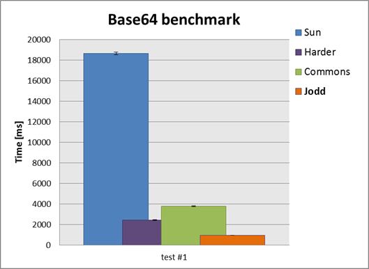

# Jodd performance

Significant effort is invested in making *Jodd* library as **fast** as
possible. It seems that, today, code performance is losing focus, and
that skill of writing fast code is somewhat lost. But not here! We are
**devoted** to code **optimization** and we have some significant
experience, starting back since days of C and assembler.

We are currently rewriting our benchmarks using JMH microbenchmark tool.
Please be patient until we publish the code and the results!
{: .attn}

This page shows some benchmarks. More results and descriptions will be
added soon.

All benchmarks are made using **bb.jar** benchmark library.

