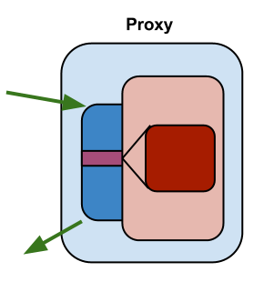

# ProxyProxetta

Once when pointcuts and advices are defined, it is easy to define a
proxy aspect itself:

~~~~~ java
    ProxyAspect aspect = ProxyAspect.of(LogProxyAdvice.class, pointcut);
~~~~~

`ProxyAspect` is nothing but a simple holder of the advice and pointcuts, used for creating `Proxetta` implementations.

This page describes `ProxyProxetta` type of proxies, but many things here are common for other *Proxetta* types as well.
{: .attn}

## Creating Proxetta (step 1)

For each type of *Proxetta*, there is a static factory method (yes, you can use `new` instead if that is your thing):

~~~~~ java
    Proxetta.proxyProxetta();
    Proxetta.wrapperProxetta();
    Proxetta.invokeProxetta();
~~~~~

Each method returns specific *Proxetta* builder. Just continue using it by following the fluent interface. Yes, it's that simple.

Let's create a new `ProxyProxetta`:

~~~~~ java
    ProxyProxetta proxetta =  Proxetta
            .proxyProxetta()
            .withAspect(aspect1)
            .withAspect(aspect2);
~~~~~

Now it's time to configure created *ProxyProxetta* - or you can just skip the next step and go with the defaults.

## Proxetta configuration (step 2)

Each `Proxetta` implementation share the same set of properties.

### forced

Specifies 'forced' mode. If `true`, the new proxy class will be
created even if there are no matching pointcuts. Otherwise, new proxy
class will be created only if there is at least one matching pointcut.

### classLoader

Specifies classloaders for loading created classes.

### variableClassName

Defines variable proxy class name, so every time when new proxy class is
created its name will be different. Therefore, one classloader may load
it without a problem. If this flag is not set, proxy class name will be
constant; Such class can be loaded only once by a classloader.

### classNameSuffix

Defines class name suffix of generated classes.

### debugFolder

When debug folder is set, *Proxetta* will save all classes upon their
creation into that folder. Very useful for debugging purposes!

## Creating Proxy (step 3)

Finally, once when `Proxetta` is created and configured, we can re-use it multiple times to create a **factory** for proxies. *Proxetta* proxy factories are responsible for creating proxy classes using bytecode manipulation.

The proxy factory then can be applied to the target class:

~~~~~ java
    proxetta.proxy().setTarget(targetClass);
~~~~~

The following factory methods are available for creating a proxy class:

* `create()` - generates class and returns its `byte[]` content.
* `define()` - loads created class bytes and returns as a `Class`.
* `newInstance()` - instantiates default constructor for defined class.

So the previous line becomes:

~~~~~ java
    Class fooClass = proxetta.proxy().setTarget(Foo.class).define();
~~~~~

or, directly an instance:

~~~~~ java
    Foo foo = proxetta.proxy().setTarget(Foo.class).newInstance();
~~~~~

Note: generated classes do not contain any debug information to avoid
`ClassFormatError`. Some 3rd party tools (like Emma) may loose some
local variable information.
{: .attn}

## ProxyProxetta overview

`ProxyProxetta` extends a target class. Pointcut method are overridden in
proxy. During the execution of adviced code in generated method, target
method is called using `super` reference. Proxy methods has the same
annotations as the target methods.

Proxy class has the same constructors as the target class. It is also of
the same type as the target class, so it can easily can be used instead.

Obviously, you can't proxy interfaces or abstract methods.

## Proxy name

By default, proxy name is created from target class name, by appending
default suffix. Suffix name can be changed. Moreover, if variable names
feature is turned on, added suffix is changed each time by appending
auto-incrementing number. In all cases, proxy class is in the same
package as target class.

Sometimes it is needed to have more control over proxy class name and
package. This is especially important when proxyfing JDK classes, since
default classloader doesn't allow to instantiate anything from `java.*`
package.

*Proxetta* allows to completely control proxy names. Every method for
proxy definition and proxy creation accept second argument that defines
proxy name in the following ways:

* `.Foo` (class name starts with a dot) - proxy package name is equal to
  target package, just proxy simple class name is set.
* `foo.` (class name ends with a dot) - proxy package is set, proxy
  simple name is create from target simple class name (suffix is
  appended).
* `foo.Foo` - full proxy class name is specified (suffix is appended).

Adding suffix can be also completely disabled, but in that case
different package for proxy class must be provided, since it is not
possible to define two classes with the same package and simple names.

Proxy name is set on builder using `setTargetProxyClassName()`.

## Integration with Petite

It is easy to apply aspects on beans registered in the
[*Petite*](/petite/) container transparently. *Petite* has
single point method for beans registration. User may override this
method and create proxy for each bean type before it is actually
registered in the container.

There is already a class that does that: `ProxettaAwarePetiteContainer`.
