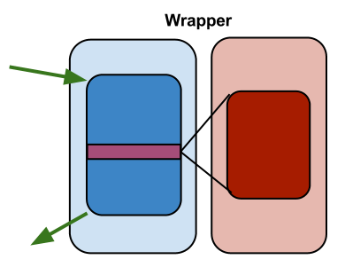

# WrapperProxetta

`WrapperProxetta` works differently than `ProxyProxetta`: instead of
extending the target class, it creates new class that delegates call to
target instance.

## WrapperProxetta overview

`WrapperProxetta` generates new class that delegates calls
to target class instance. It is not enough to create a wrapper class and
the instance - you must inject the target instead into it, too.

There are 3 ways how to build a wrapper.

### Wrapper over class

Resulting object is custom type that implements all interfaces of the
target. All target methods are wrapped.

### Wrapper over class, casted to interface

Similar as above, except the resulting type implements one interface
(provided by user). Still, all target methods are wrapped, even those
that does not belong to the interface. They can be invoked using e.g.
reflection.

### Wrapper over interface

Resulting object has one interface, and only interface methods are
wrapped.

## Example

Here is an example how to create wrapper class and inject target
instance into it.

~~~~~ java
    WrapperProxetta proxetta = Proxetta
    		.wrapperProxetta()
    		.withAspect(aspect);
    WrapperProxettaFactory factory = proxetta
			.proxy()
			.setTarget(calc.getClass())
			.setTargetInterface(Calc.class);

    Calc calc = factory.newInstance();
    factory.injectTargetIntoWrapper(calc, calculatorObject);
~~~~~
