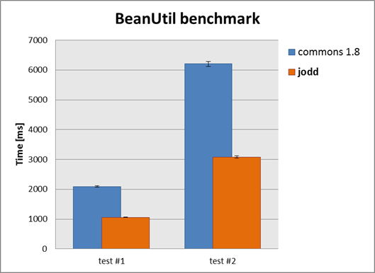

# BeanUtil 

Bean utilities allow setting and reading bean properties. Several
features make `BeanUtil` distinct from other similar libraries:

* the *fastest* bean manipulation utility
* works with both *attributes* and *properties*
* nested properties can be arrays, lists and maps
* missing inner properties may be created
* can work silently
* offers few populate methods
* has strong type conversion library

## Working with bean properties

In `BeanUtil` world, bean property is a class field with its *optional*
setter and getter (aka accessors) methods. When accessing properties,
`BeanUtil` first tries to use accessors methods. If they don't exist,
`BeanUtil` failbacks to using the field of the same visibility.
Therefore, existence of accessors methods is not required and depends on
usage, what often may be handy. `BeanUtil` is used internally inside
the *Jodd* library, so this behavior applies everywhere.

Simple bean:

~~~~~ java
    public class Foo {
    	private String readwrite;   // with getter and setter
    	private String readonly;    // with getter
    	...
    }
~~~~~

Usage:

~~~~~ java
    Foo foo = new Foo();
    BeanUtil.setProperty(foo, "readwrite", "data");
    BeanUtil.getProperty(foo, "readwrite");
    BeanUtil.setDeclaredProperty(foo, "readonly", "data");
~~~~~

Lines #2 and #3 show common and expected `BeanUtil` usage: setting value
of read-write property through it's accessors methods. Setting
`readonly` property in above example is only possible with
`setDeclaredProperty()` method. It first tries to use `setReadonly()`
method, but since such doesn't exist, field is used directly.

## Nested properties

`BeanUtil` supports nested properties. Besides other bean, nested
property may be also a **list**, a **map** or an **array** element:

~~~~~ java
    BeanUtil.getProperty(cbean, "list[0].map[foo].foo");
    BeanUtil.setProperty(cbean, "arr[4].map[elem.boo].foo", "test");
~~~~~

When accessing nested properties, `BeanUtil` goes one property at time
and expects that all nested properties (except the very last one) exist
i.e. to be not-`null`. Above example is executed as shown by this
following pseudo-code:

~~~~~ java
    cbean.getList().get(0).get("foo").getFoo();
    cbean.getArr()[4].get("elem.boo").setFoo("test");
~~~~~

## Forced setting of nested properties

Setting of nested properties fails if one of the (middle) elements on
the path is `null`. To overcome this behavior, properties may be set in
*forced* mode:

~~~~~ java
    BeanUtil.setPropertyForced(x, "y.foo", value);
    BeanUtil.setPropertyForced(x, "yy[2].foo", "xxx");
~~~~~

If the object `x` in above example has uninitialized property `y`,
`BeanUtil` first creates a new instance of `y`\'s type, that will be set
to property `y`. Then, `foo` property of newly created object `y` will
be set. In the second example, `yy` is an array. If it is uninitialized,
`BeanUtil` will create a new array of length 3. Then, it will create a
new instance of `yy`\'s type that will be stored as third element of the
array. Finally, the `foo` property is set.

In forced mode, `BeanUtil` tries to instantiate uninitialized properties
needed for setting the final property. Instantiation depends of the
type: if it is a simple bean, no-args constructor will be invoked. If it
is a list, new `ArrayList` will be created. Similar applies for arrays
and map types. Additionally, `BeanUtil` will check the length of
existing initialized arrays and lists and if the current size is not
enough, list or array will be expanded by adding `null` elements up to
the new size.

### Generics support

When creating a new element of an list, `BeanUtil` will consider
existing generics information in order to create element of correct
type.

## Silent work (no exceptions)

Property setting may fail from various reasons, causing an unchecked
exception (`BeanUtilException`) to be thrown. Sometimes this is not
desired behavior. For such usages, `BeanUtil` offers *silent* version of
methods that will not throw an exception at all. If setting is not
successful, simple nothing will happened.

## Populate

`BeanUtil` offers few methods for populating properties and beans from
Map/List bean representation. This is handy when some JSON string should
be deserialized into the bean.

## Self-reference

In some (rare) occasions `BeanUtil` has to work on arrays, `List`s or
`Map`s directly instead with beans. In such cases it is needed to
somehow reference this object, in order to use its elements. For such
situations, `BeanUtil` introduce special self-reference property name:
\"**\*this**\". It simply points to current reference.

For example, lets say that it is needed to reference some element from
context map (or array, or list) using `BeanUtil` and to set value of one
of it's properties: `context[foo].boo`. Since context is the target
bean used as an argument of `BeanUtil`, it is needed be able to somehow
access it in the property name. This is possible with self-reference:

~~~~~ java
    BeanUtil.setProperty(ctx, "*this[foo].boo", value);
~~~~~

With self-reference you may also set `Map` keys that have a dot in its name:

~~~~~ java
    Properties properties = new Properties();
    BeanUtil.setProperty(property, "*this[ldap.auth.enabled]", "true");
~~~~~

Although it's purpose is to be used on very start of nested property
name, self-reference may be used anywhere in between. So the following
two property names are identical:

~~~~~ java
    BeanUtil.getProperty(fb4, "data[0].bbean.abean.fooProp");
    BeanUtil.getProperty(fb4, "*this.data.*this[0].*this.bbean.abean.fooProp");
~~~~~

You can change the self-reference keyword (`*this`) by setting static
variable: `BeanUtilBean.THIS_REF`.

From recent versions of *BeanUtil*, self-reference is implicitly used
for the first simple bean, so you can omit the keyword:

~~~~~ java
    Properties properties = new Properties();
    BeanUtil.setProperty(property, "[ldap.auth.enabled]", "true");
~~~~~

## Testing of property existence

`BeanUtil` also offers convenient way to test if some property exists:

~~~~~ java
    BeanUtil.hasProperty(fb, "fooInteger")
~~~~~

## Type conversion

When setting properties, *BeanUtil* converts type of provided value to
match the destination. For this purpose it uses *Jodd*s [type converter](typeconverter.html) utility.

Getting properties always returns an `Object`. If you need to cast it to
some type, you can use `TypeConverterManager#convertType`. The following
snippet (from [Liferay](http://www.liferay.com) portal) shows the usage:

~~~~~ java
    public boolean getBoolean(Object bean, String param, boolean defaultValue) {
    	Boolean booleanValue = null;
    	if (bean != null) {
    		Object value = BeanUtil.getProperty(bean, param);
    		beanValue = TypeConverterManager.convertType(value, Boolean.class);
    	} catch (Exception ex) {
    		// log error
    	}
    	if (booleanValue == null) {
    		return defaultValue;
    	} else {
    		return booleanValue.booleanValue();
    	}
    }
~~~~~

## BeanUtilBean

`BeanUtil` is just a static delegate class to default `BeanUtilBean`
instance. Therefore, it is possible to change behavior of `BeanUtil` as
well as to change the default type conversion rules.

## BeanCopy

There is more: `BeanCopy` class offers copying functionality. It copies
properties from source to destination bean.

## BeanTemplateParser

`BeanTemplateParser` is based on
[StringTemplateParser](stringtemplateparser.html). a string template
with JSP-alike markers that indicates where provided context values will
be injected. Usage is quite simple:

~~~~~ java
    // prepare template
    String template = "Hello ${user.name}. Today is ${dayName}.";
    ...

    // prepare context
    Foo foo = new Foo();
    foo.getUser().setName("John Doe");
    foo.setDayName("Saturday");
    ...
    // parse
    BeanTemplateParser btp = new BeanTemplateParser();
    String result = btp.parse(template, foo);
    // result == "Hello John Doe. Today is Saturday."
~~~~~

## Performance test

`BeanUtil` seems almost 20% faster compared to
[Common's BeanUtils v1.8](http://commons.apache.org/beanutils/).
However, the performance is not the only reason why `BeanUtil` is a good choice, as seen above.

You can [download the performance test source](BeanUtilPerformanceTest.java).