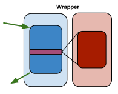

<js>javadoc('proxetta')</js>

# Proxetta

*Proxetta* creates dynamic proxies in run-time, providing efficient
support for aspects.

A proxy class is a class that wraps or extends target class specified at
runtime. Proxy **Aspect** contains advice and pointcut rules for
applying advice. Proxy **Advice** is the code portion of an aspect, i.e.
the logic that replaces crosscutting concern. **Pointcut** is a set of
points in the application where advice should be applied, i.e. which
methods will be wrapped by proxy.

## Proxetta types

*Proxetta* offers 3 different proxy types, that we call: `Proxy`,
`Wrapper `and `InvokeReplacer`. Here is an overview of each type.

### Proxy

`ProxyProxetta` is *Proxetta* that extends the target class (*red*).
Pointcut methods (*dark red*) are overridden in proxy subclass (*blue*)
and called when required from the advice (*dark blue*).

Therefore, instead of working with target instance, we have proxified
instance. It will be of the same type as the target (since it's a
subclass).

### Wrapper

`WrapperProxetta` is *Proxetta* that creates a separate, wrapper class
(*blue*) from the target class (*red*). Wrapper class holds the
reference of the target class instance. Pointcut methods (*dark red*)
are called from the wrapper advice methods (*dark blue*). But wrapper
also delegates call to other target methods.

*Proxetta* offers furthermore several ways how the wrapper behave, and
should it implement some interface.

### InvokeReplacer

Finally, `InvokeProxetta` is bit different and unique type of proxy. It
creates a clone class and replaces invocation of target methods in the
method code with adviced method invocation. In other words, it simply
replaces method calls in target class.

## Reasons why

What is unique is the way how pointcuts and advices are defined.

*Proxetta* pointcuts are defined in pure Java, no custom proprietary
notation is used. Therefore, any matching mechanism may be used: regular
expression, wildcards; configuration might be stored in external (XML)
files and so on.

*Proxetta* advices uses completely different concept than any other AOP
library. Advices are written in the same way as user would write real
subclass. Instead of using custom class for accessing proxified method
and its arguments, they will be **replaced** directly on the usage
place.

This approach makes *Proxetta* fast. Very fast.

Invocation replacements proxies is another unique feature of *Proxetta*.

## Performance test

Because of its unique approach for advices definition, *Proxetta* is
very fast. Compared to one of the most used code generation libraries,
[CGLIB][1], invocation of proxified method is
significantly faster.

<js>docnav('proxetta')</js>

[1]: http://cglib.sourceforge.net/