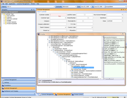

<link rel="stylesheet" type="text/css" href="/css/jquery.lightbox.css"/>

# SwingSpy

`SwingSpy` is simple resident Swing introspector. It shows hierarchy of
dialog elements under the cursor.

## Installation

Add *Jodd* distribution jar to classpath (if it is not already there;)
and somewhere at the startup of Swing application invoke the following
code:

~~~~~ java
    try {
    	Class.forName("jodd.swingspy.SwingSpy").getMethod("install").invoke(null);
    } catch (Exception ex) {
    	System.err.println("SwingSpy is not installed... " + ex.toString());
    }
~~~~~

## Usage

Once installed, `SwingSpy` may be invoked by pressing the hot-key
combination: **ctrl+shift+click**. This popups the `SwingSpy` dialog
that shows complete hierarchy of active Swing dialog and some raw object
data on the right. Clicked component will be expanded in the hierarchy
three. While `SwingSpy` is active, user may hover the cursor over swing
dialog and component under the cursor will be highlighted. During that
time, cursor will be followed by word: "Spy". By clicking the hotkey
again over some other component, `SwingSpy` will locate it in the
hierarchy three. `SwingSpy` may be exited by closing its dialog. It
remains resident until the next use.

## Examples

[{: width="256" height="184" .b}](swingspy.jpg){: .lightbox}
[{: width="256" height="199" .b}](swingspy2.png){: .lightbox}
