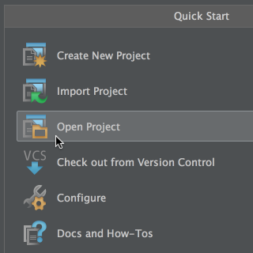

# Jodd Open Source Code

*Jodd* source is hosted on **GitHub**.

<a href="https://github.com/oblac/jodd"> https://github.com/oblac/jodd</a>

## Get Jodd source

Simple clone *Jodd* Git repository:

	git clone https://github.com/oblac/jodd.git jodd

## Build Instructions

*Jodd* is built with [Gradle](http://gradle.org) on [JDK6](http://www.oracle.com/technetwork/java/javasebusiness/downloads/java-archive-downloads-javase6-419409.html), targeting **Java 1.5**. You don't have to install anything, the only prerequisites are [Git](http://help.github.com/set-up-git-redirect) and Java JDK.

After cloning *Jodd* repo, you can build the project with:

	gradlew build

This will build all jars and run all unit tests. To skip the tests (for faster build), execute:

	gradlew build -x test

To generate full release, including running integration tests and generating various reports:

	gradlew release

And that's all!

### Running Integration Tests

Integration tests are executed only when building `release` task or `testAll` task.

For integration tests you will need also to set up databases named: '`jodd-test`' on local **MySql** (access: _root_/_root!_) and **PostgreSQL** (_postgres_/_root!_).

## Using Java IDE

Since *Jodd* is a *Gradle* project, you can easily open it by selecting main `build.gradle` in
every modern Java IDE (**IntelliJ IDEA**, **Eclipse**, **Netbeans**).

### IntellJ IDEA

IntelliJ IDEA can open *Jodd* project very nicely. First, make sure you have
installed **Gradle** and that you have enabled **Gradle plugin** in IDEA.
Then just follow the simple steps:

**1) Open project**

**2) Wait until Gradle project is build**

**3) Import Gradle project**

*Jodd* uses JDK5, but you can use any other JDK you have installed. Thats all!

### Eclipse

Eclipse users also should change the "_Deprecated and restricted API_" setting, to log "_Forbidden references_" as **Warnings** (and not Errors). We have some test cases that uses restricted API - don't worry, it's _only_ used in the tests!

This Eclipse option is located here: Windows > Preferences > Java > Compiler > Errors/Warnings or (Project) Properties > Java Compiler > Error/Warnings.

## Contribute!

Feel free to contribute! We accept patches, diffs and pure sources :)

The best way to contribute would be via **GitHub**, using the following workflow:

+ fork *Jodd* repo (<code>upstream</code>) to your **GitHub** account (`origin`)
+ clone `origin` to `local` repo
+ make branch for your work, commit often
+ push `local` branch to `origin`
+ when the work is done, send us pull request (PR)

Welcome!